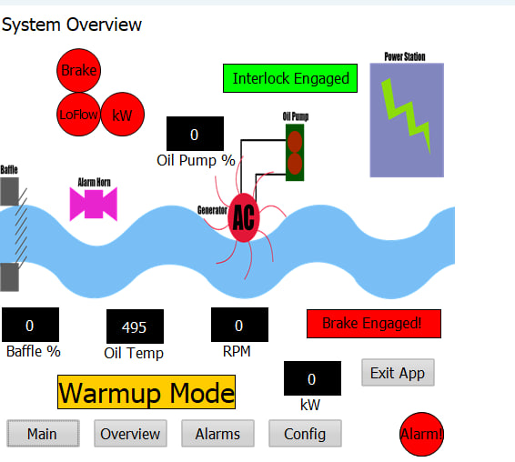
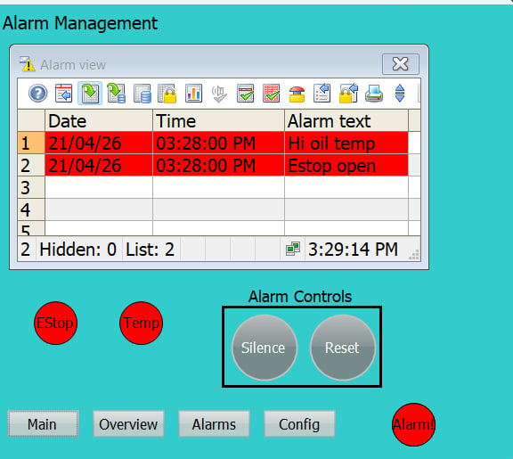
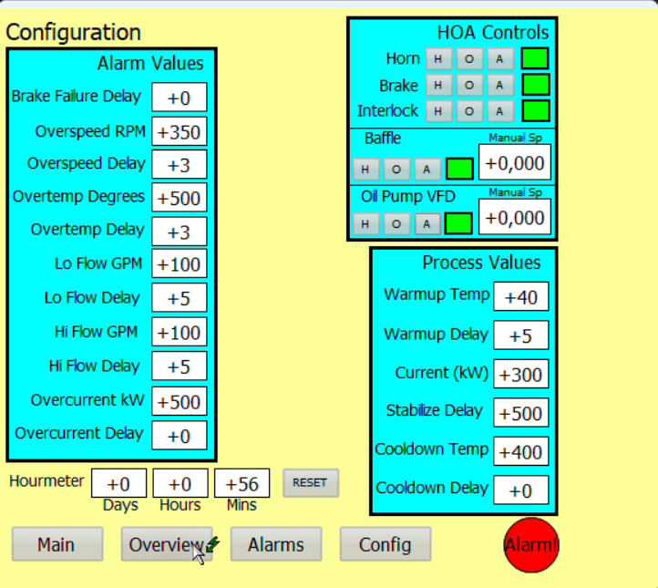
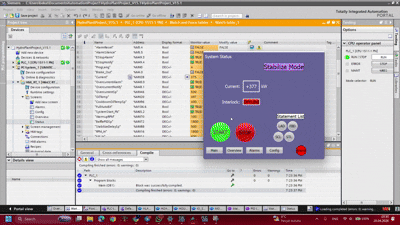
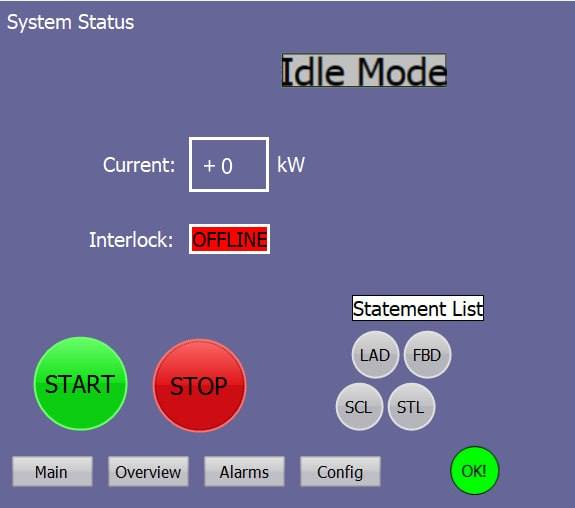
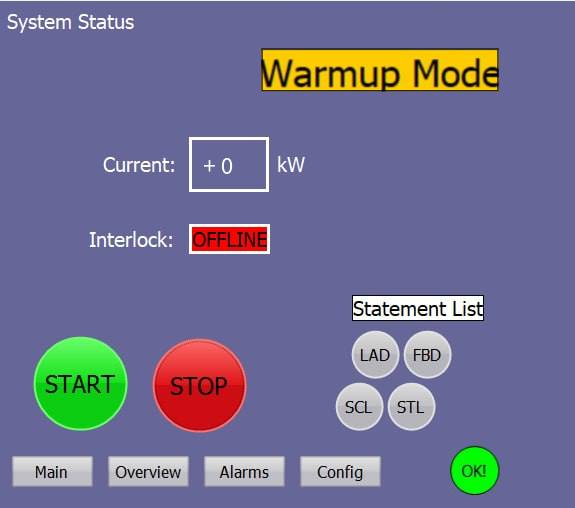
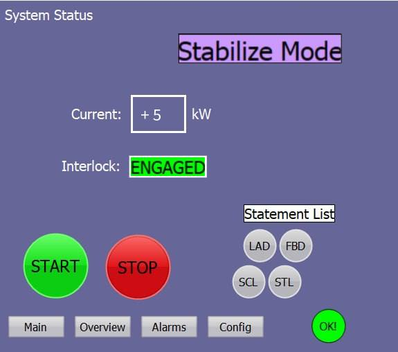
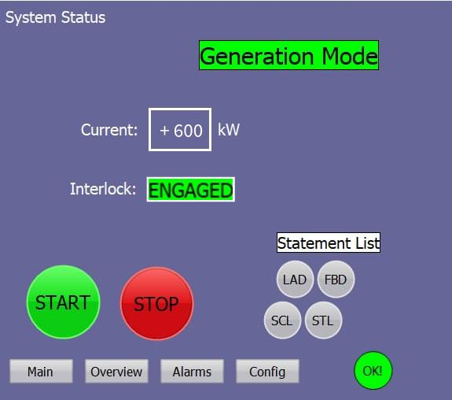
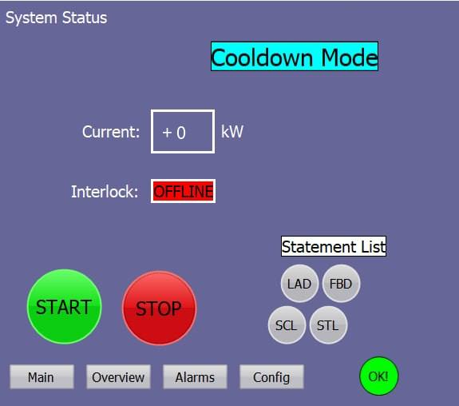
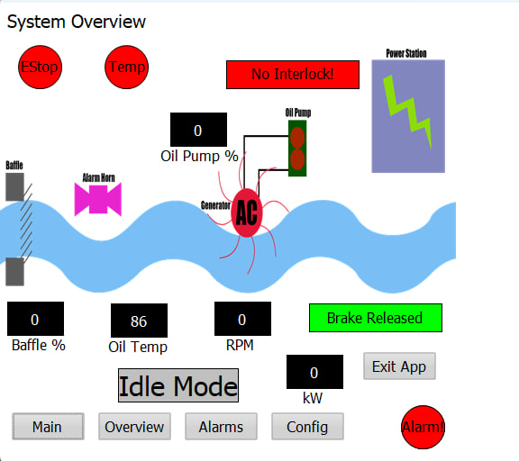

# 💧 Hydroelectric Power Plant — PLC Control System

> **TIA Portal V15 | LAD · FBD · SCL · STL · S7-GRAPH | WinCC HMI | Analog & Digital I/O | Alarm Management**

A fully programmed PLC control system for a simulated hydroelectric power plant, developed in Siemens TIA Portal. The project covers a complete sequence of operation (Warmup → Stabilize → Generation → Cooldown → Idle), analog I/O scaling, HOA control modes, ISA-style alarm management, and a multi-screen WinCC HMI.

---

## 📸 HMI Screenshots

| System Status | Process Overview |
|:---:|:---:|
|  |  |

| Alarm Management | IO / HOA Panel |
|:---:|:---:|
|  |  |

---

## 🎬 Demo

> *(Optional — add a GIF or YouTube link showing the full sequence)*

<!--  -->
<!-- [](https://youtu.be/YOUR_VIDEO_ID) -->

---

## 📋 Project Overview

This project implements PLC controls for a crude but fully functional hydroelectric power plant simulation. A river flows through a baffle (proportional control valve), drives a generator rotor, and the resulting AC current is delivered to a power station — all managed automatically by the PLC.

### System Flow

```
River → [Baffle / Control Valve] → Generator Rotor → AC Current → Power Station
                                         ↕
                               Oil Pump VFD (bearing cooling)
```

---

## 🧠 Programming Languages Used

This project deliberately uses all major IEC 61131-3 languages available in TIA Portal, each chosen for where it fits best:

| Language | Used For |
|----------|----------|
| **LAD** (Ladder Diagram) | Digital interlock logic, coil/contact-style safety conditions, E-Stop rungs |
| **FBD** (Function Block Diagram) | Analog scaling blocks, PID controller wiring, VFD enable/speed chains |
| **SCL** (Structured Control Language) | Alarm logic, setpoint comparisons, OEE-style calculations, complex conditionals |
| **STL** (Statement List) | Low-level register operations, accumulated timer logic |
| **S7-GRAPH** (SFC) | Main sequence of operation — Warmup → Stabilize → Generation → Cooldown → Idle |

The **System Status HMI screen includes a language toggle button** that switches the active display language between LAD, FBD, SCL, and STL views — useful during commissioning and maintenance when different engineers prefer different representations of the same logic.

---

### Sequence of Operation (S7-GRAPH Block)

The plant runs a strictly ordered S7-GRAPH (SFC) sequence. Each phase has defined entry conditions, active control actions, and transition logic before advancing. The sequence can only start when `FullAutoBit` confirms all HOA switches are in AUTO and all alarms are cleared.

---

#### Phase 1 — IDLE

The baseline safe state. Mechanical brakes are locked (`Brake_Ctrl := 1`) and grid interlocks are physically open. The SCL logic continuously scans the plant; the automated sequence is locked out until the `FullAutoBit` confirms all manual override switches are cleared.



---

#### Phase 2 — WARMUP

Initiated by the operator Start command. Mechanical brakes release and the VFD oil pump activates at low speed. To prevent bearing damage, the turbine is restricted from spinning up until lubricating oil reaches the minimum operating temperature (>40 °C) and holds for a 5-second validation delay before the sequence advances.



---

#### Phase 3 — STABILIZE *(Pre-Synchronization)*

Baffle control is handed over to a continuous PID algorithm. The controller modulates the water gate to hunt and lock turbine speed at exactly 1800 RPM. The grid interlock remains open while the system confirms absolute rotational stability within ±5 kW for 10 continuous seconds before advancing.



---

#### Phase 4 — GENERATION

The nominal operating state. Upon confirming stable synchronous speed, the global interlock engages (`StationIntl_Ctrl := 1`) and the plant exports 600 kW of active power to the grid. The PID loop continues making micro-adjustments to the baffle to counteract simulated dynamic river currents.



---

#### Phase 5 — COOLDOWN

Triggered by a nominal Stop command. The grid connection is severed instantly to stop power export. The water baffle closes to 0%, but the VFD oil pump is forced to continue circulating coolant until turbine bearings safely drop below 35 °C. Once cooled for 10 continuous seconds, the system returns to IDLE.



---

#### Phase 6 — FAULT

A global safety override that runs outside the main sequence. If any critical limit (Overspeed, Overcurrent, Brake Failure, E-Stop) is breached, the S7-GRAPH sequence is immediately aborted. The baffle slams shut, interlocks open, and the SCADA alarm horn energizes. The plant requires a physical inspection and manual `AlarmReset` to recover.



---

### Alarm Management
All alarm setpoints and delay times are configurable as tags (tunable from HMI).

| Alarm | Setpoint | Delay | Process Action |
|-------|----------|-------|----------------|
| Overcurrent | 550 kW | 5 sec | Disengage interlock → normal shutdown |
| High Oil Temp | 400° | 5 sec | Disengage interlock → normal shutdown |
| Rotor Overspeed | 180 RPM | 5 sec | Disengage interlock → normal shutdown |
| Oil Low Flow | < 5 GPM (VFD on, brake off) | 10 sec | Disengage interlock, deenergize VFD, open baffle, engage brake |
| Oil High Flow | 30 GPM | 5 sec | Disengage interlock → shutdown; VFD override to 50% |
| E-Stop | DI open | Immediate | Disengage interlock, deenergize VFD, open baffle, engage brake; HOAs → OFF/HAND |
| Brake Failure | RPM > 0 with brake on | 30 sec | Disengage interlock, deenergize VFD, open baffle, engage brake |

### HOA Control Modes
Every device has Hand / Off / Auto control:
- **HAND** — Device runs permanently until mode changes
- **OFF** — Device forced off
- **AUTO** — Device controlled by sequence logic

### Analog I/O Scaling

| Signal | Tag | Raw Range | Engineering Range |
|--------|-----|-----------|-------------------|
| Baffle Output | `Baffle_Out` | 0–27648 | 0–100% open *(reverse polarity)* |
| Rotor Speed | `RPM_In` | 0–27648 | 0–200 RPM |
| Oil Pump VFD Speed | `OilPumpVFDsp_Out` | 0–27648 | 0–100% |
| Oil Flow | `OilFlow_In` | 0–27648 | 0–30 GPM |
| Oil Temperature | `OilTemp_In` | 0–27648 | 0–500° |
| AC Current | `ACCurrent_In` | 0–27648 | 0–700 kW |

---

## 🖥️ HMI Screens (WinCC)

### 1. System Status *(Default)*
- Current mode indicator (Warmup / Stabilize / Generation / Cooldown / Idle / Fault)
- Alarm presence indicators
- Key process values (RPM, kW, Oil Temp, Oil Flow)
- Start / Stop buttons
- System will NOT start unless all devices are in AUTO and all alarms are cleared

### 2. Process Overview
- Graphical representation of the plant layout
- Process values displayed at their physical collection points
- Real-time status indicators for all devices

### 3. Alarm Management
- Full alarm history log
- Alarm reset and silence buttons
- Live alarm bit indicators (not just notifications)

### 4. IO / HOA Panel
- HOA mode selectors for every device
- Manual analog setpoints for VFD and Baffle
- Live input signal readbacks
- Alarm inhibit indicators for affected devices

---

## 🗂️ Project Structure

```
hydroelectric-plc/
│
├── TIA_Portal/
│   └── HydroPlant.ap15          # TIA Portal V15 project archive (.ap15 export)
│
├── media/                       # All screenshots and GIFs
│   ├── idle_mode.png
│   ├── warmup_mode.png
│   ├── stabilize_mode.png
│   ├── generation_mode.png
│   ├── cooldown_mode.png
│   ├── fault_mode.png
│   ├── hmi_status.png
│   ├── hmi_overview.png
│   ├── hmi_alarms.png
│   ├── hmi_hoa.png
│   └── full_sequence_demo.gif   # Optional
│
├── docs/
│   ├── IO_List.xlsx             # Full I/O table with tag names and scaling
│   └── ProjectDetail.pdf        # Original project specification
│
└── README.md
```

---

## 🔧 Tools & Environment

| Tool | Detail |
|------|--------|
| Siemens TIA Portal | V15 |
| PLC | S7-1500 (simulated via PLCSIM Advanced) |
| HMI Runtime | WinCC Comfort |
| Languages Used | LAD (Ladder), FBD (Function Block Diagram), SCL (Structured Text), STL (Statement List), S7-GRAPH (SFC) |

> All five IEC 61131-3 language views are used in this project. The System Status HMI screen includes a **language toggle button** allowing the operator to switch the active programming language view during runtime — useful for maintenance and commissioning across different engineer preferences.

---

## 🚀 How to Open

1. Install **TIA Portal V15** (with WinCC Comfort and S7-PLCSIM)
2. Clone or download this repository
3. Open TIA Portal → *Project* → *Retrieve* → select `TIA_Portal/HydroPlant.ap15`
4. Start PLCSIM and create a virtual S7-1500 instance
5. Download the project to the virtual PLC
6. Launch the WinCC simulation to interact with the HMI

---

## 📌 Key Design Decisions

- **Baffle polarity is reversed** — a raw output of 0 = 100% open; 27648 = fully closed. Scaling logic accounts for this inversion.
- **Alarm setpoints are configurable tags** — no hardcoded values in logic; all tunable from the HMI.
- **Oil Low Flow alarm has a 10-second delay** (not the standard 5 sec) and is inhibited when the VFD is off.
- **E-Stop is on the HMI** (as specified) — immediate action, no delay.
- **Brake Failure** uses a 30-second delay to allow for normal coasting before flagging a fault.
- **Oil High Flow** overrides VFD to 50% of the pre-fault output during shutdown to avoid pump runaway.

---

## 📄 License

This project was completed as a portfolio capstone for the **Paul Lynn PLC Dojo** course curriculum. It is shared here for educational and portfolio purposes.
